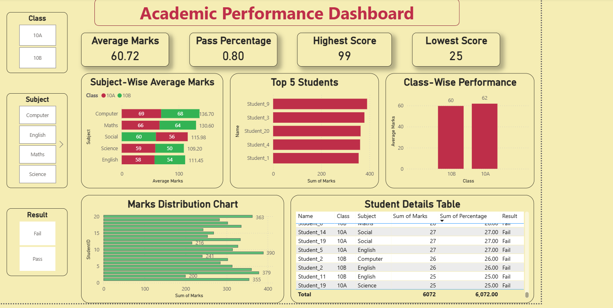

📊 Academic-Performance-Insights

This project focuses on analyzing student academic performance across 5 major subjects using Python, SQL, and Power BI.
The goal is to derive insights such as:

-> Subject-wise performance

-> Top and low-performing students

-> Pass/Fail analysis

-> Class-level comparison

-> Personalized dashboard insights

This project showcases a complete end-to-end data analytics workflow.

📂 Project Structure
students-marks-analysis/
│
├── dataset/
│   ├── student_marks_dataset.csv         # Raw dataset
│   └── cleaned_student_marks.csv         # Cleaned dataset with % & result
│
├── sql/
│   ├── create_table.sql                  # SQL table creation
│   └── analysis_queries.sql              # SQL analysis queries
│
├── python/
│   └── analysis.ipynb                    # Python EDA & data cleaning
│
├── powerbi/
│   └── Students_Marks_Dashboard.pbix     # Final dashboard
│
└── README.md                             # Project documentation

🛠 Tools & Technologies Used
Skill                                Tool	Purpose
* Python (Pandas, NumPy)  -  	Data cleaning, percentage & result calculation
* MySQL	                  -   Data storage, SQL analytics
* Power BI	              -   Dashboard creation & insights
* GitHub	                -   Version control & project hosting

🧹 Data Cleaning (Python)

Performed in analysis.ipynb:

-> Removed missing and invalid values

-> Added Percentage column

-> Added Result (Pass/Fail) column

-> Fixed data types

-> Exported clean dataset

🗃 SQL Tasks

Stored in create_table.sql & analysis_queries.sql:

* Creating student table

* Loading CSV into MySQL

* Subject-wise average

* Top 5 students

* Pass percentage

* Class-wise comparison

* Overall performance insights

📊 Power BI Dashboard

Dashboard includes:

KPI Cards

* Overall Average Marks

* Pass %

* Highest & Lowest Scores

CHARTS

* Subject-wise Average Score

* Class-wise Performance

* Top 5 Students

* Marks Distribution

SLICERS

* Class

* Subject

* Result

TABLE VIEW

-> All students with final percentage & result

🔍 Key Insights

* Identified subjects with highest/lowest performance

* Class 10A vs 10B comparison

* Top performers and low scorers

* Overall pass rate

* Subjects needing academic improvement

## 📊 Dashboard Preview

### Overview Dashboard

 🚀 Conclusion

This project demonstrates a complete data analytics lifecycle:

✔ Data Cleaning
✔ SQL Storage & Querying
✔ Visualization with Power BI
✔ Insights & Reporting

👤 Author

Bohdad Sheerin Aspiring Data Analyst | Python | SQL | Power BI

⭐ Acknowledgement

Dataset provided by Kaggle. This project is created for educational and portfolio purposes.
